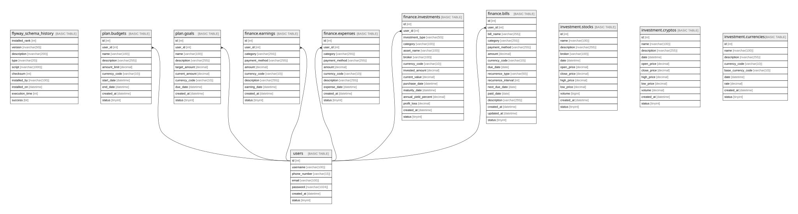

# fin_pulse

## Tables

| Name | Columns | Comment | Type |
| ---- | ------- | ------- | ---- |
| [flyway_schema_history](flyway_schema_history.md) | 10 |  | BASIC TABLE |
| [users](users.md) | 7 | Stores registered application users and their authentication data. | BASIC TABLE |
| [plan.budgets](plan.budgets.md) | 10 | Defines user-created financial budgets within the planning module. | BASIC TABLE |
| [plan.goals](plan.goals.md) | 10 | Tracks user-defined financial goals and their progress toward a target amount. | BASIC TABLE |
| [finance.earnings](finance.earnings.md) | 10 | Records user earnings, such as salary, bonuses, or other income sources. | BASIC TABLE |
| [finance.expenses](finance.expenses.md) | 10 | Records user expenses, including purchase details, amounts, and payment methods. | BASIC TABLE |
| [finance.investments](finance.investments.md) | 15 | Stores detailed records of user investments across multiple asset types and platforms. | BASIC TABLE |
| [finance.bills](finance.bills.md) | 16 | Defines bills and recurring payment obligations for users, including due dates, amounts, and status tracking. | BASIC TABLE |
| [investment.stocks](investment.stocks.md) | 12 | Stores historical or real-time stock market price data,         including open, close, high, low, and volume for a given date. | BASIC TABLE |
| [investment.cryptos](investment.cryptos.md) | 11 | Stores historical or real-time cryptocurrency price data including         open, close, high, low, and volume for a given date. | BASIC TABLE |
| [investment.currencies](investment.currencies.md) | 9 | Stores historical foreign exchange rates between a currency and a base currency for a given date. | BASIC TABLE |

## Relations

---

> Generated by [tbls](https://github.com/k1LoW/tbls)
