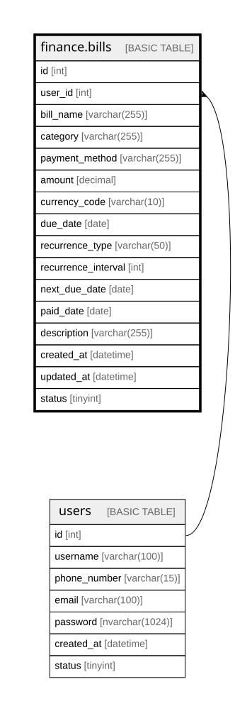

# finance.bills

## Description

Defines bills and recurring payment obligations for users, including due dates, amounts, and status tracking.

## Columns

| Name | Type | Default | Nullable | Children | Parents | Comment |
| ---- | ---- | ------- | -------- | -------- | ------- | ------- |
| id | int |  | false |  |  | Unique identifier for each bill record (primary key). |
| user_id | int |  | false |  | [users](users.md) | References the user who owns the bill record (foreign key to dbo.users). |
| bill_name | varchar(255) |  | false |  |  | Descriptive name of the bill (e.g., Electricity, Internet, Rent). |
| category | varchar(255) |  | false |  |  | Category describing the type of bill (e.g., Utilities, Housing, Subscriptions). |
| payment_method | varchar(255) |  | true |  |  | Method used for bill payment (e.g., Credit Card, Debit, Bank Transfer). |
| amount | decimal |  | false |  |  | Monetary amount due for the bill. |
| currency_code | varchar(10) |  | false |  |  | Currency code representing the bill currency (e.g., USD, BRL, EUR). |
| due_date | date |  | false |  |  | Date when the bill is due for payment. |
| recurrence_type | varchar(50) |  | true |  |  | Type of recurrence pattern (e.g., Monthly, Yearly, None). |
| recurrence_interval | int | ((1)) | true |  |  | Interval between bill recurrences (e.g., every 2 months). |
| next_due_date | date |  | true |  |  | Next scheduled due date for recurring bills. |
| paid_date | date |  | true |  |  | Date when the bill was paid, if applicable. |
| description | varchar(255) |  | true |  |  | Optional description providing additional context about the bill or payment details. |
| created_at | datetime | (getdate()) | false |  |  | Timestamp when the bill record was created. |
| updated_at | datetime |  | true |  |  | Timestamp when the bill record was last updated. |
| status | tinyint | ((1)) | false |  |  | Status flag for the bill (1=Active, 0=Inactive, 2=Paid, 3=Cancelled). |

## Constraints

| Name | Type | Definition |
| ---- | ---- | ---------- |
| PK__bills_* | PRIMARY KEY | CLUSTERED, unique, part of a PRIMARY KEY constraint, [ id ] |
| FK__bills__user_id_* | FOREIGN KEY | FOREIGN KEY(user_id) REFERENCES users(id) ON UPDATE NO_ACTION ON DELETE NO_ACTION |

## Indexes

| Name | Definition |
| ---- | ---------- |
| PK__bills_* | CLUSTERED, unique, part of a PRIMARY KEY constraint, [ id ] |

## Relations

---

> Generated by [tbls](https://github.com/k1LoW/tbls)
