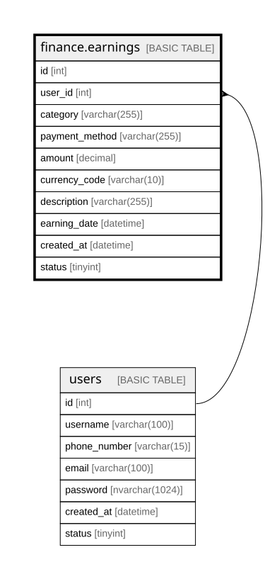

# finance.earnings

## Description

Records user earnings, such as salary, bonuses, or other income sources.

## Columns

| Name | Type | Default | Nullable | Children | Parents | Comment |
| ---- | ---- | ------- | -------- | -------- | ------- | ------- |
| id | int |  | false |  |  | Unique identifier for each earning record (primary key). |
| user_id | int |  | false |  | [users](users.md) | References the user who owns the earning record (foreign key to dbo.users). |
| category | varchar(255) |  | false |  |  | Category describing the earning source (e.g., Salary, Bonus, Freelance). |
| payment_method | varchar(255) |  | false |  |  | Method by which the earning was received (e.g., Bank Transfer, Cash, Card). |
| amount | decimal |  | false |  |  | Total amount of money earned in the transaction. |
| currency_code | varchar(10) |  | false |  |  | Currency code for the earning (e.g., USD, BRL, EUR). |
| description | varchar(255) |  | true |  |  | Optional text describing the earning or its source in more detail. |
| earning_date | datetime |  | false |  |  | Date when the earning was received or recorded. |
| created_at | datetime | (getdate()) | false |  |  | Date and time when the earning record was created in the system. |
| status | tinyint | ((1)) | false |  |  | Indicates if the earning record is active (1), inactive (0), or archived. |

## Constraints

| Name | Type | Definition |
| ---- | ---- | ---------- |
| PK__earnings_* | PRIMARY KEY | CLUSTERED, unique, part of a PRIMARY KEY constraint, [ id ] |
| FK__earnings__user_i_* | FOREIGN KEY | FOREIGN KEY(user_id) REFERENCES users(id) ON UPDATE NO_ACTION ON DELETE NO_ACTION |

## Indexes

| Name | Definition |
| ---- | ---------- |
| PK__earnings_* | CLUSTERED, unique, part of a PRIMARY KEY constraint, [ id ] |

## Relations

---

> Generated by [tbls](https://github.com/k1LoW/tbls)
