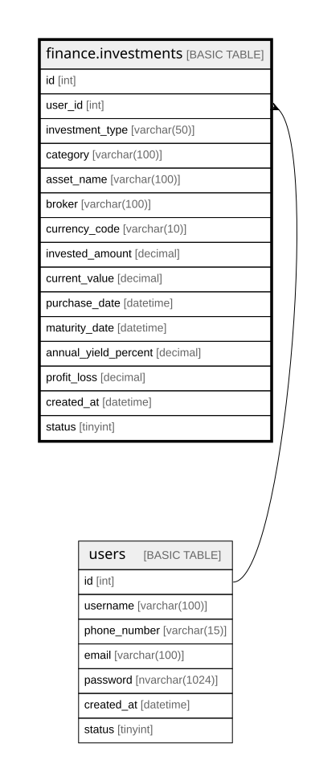

# finance.investments

## Description

Stores detailed records of user investments across multiple asset types and platforms.

## Columns

| Name | Type | Default | Nullable | Children | Parents | Comment |
| ---- | ---- | ------- | -------- | -------- | ------- | ------- |
| id | int |  | false |  |  | Unique identifier for each investment record (primary key). |
| user_id | int |  | false |  | [users](users.md) | References the user who owns the investment (foreign key to dbo.users). |
| investment_type | varchar(50) |  | false |  |  | Investment type classification (e.g., Renda Fixa, Renda Variável, Cripto, Fundo, Tesouro, Imobiliário). |
| category | varchar(100) |  | false |  |  | Subcategory within the investment type (e.g., CDB, Ações, FIIs). |
| asset_name | varchar(100) |  | false |  |  | Name or ticker symbol of the invested asset (e.g., PETR4, CDB Itaú, Tesouro IPCA+). |
| broker | varchar(100) |  | true |  |  | Financial platform or broker managing the investment (e.g., XP, Nubank, Binance). |
| currency_code | varchar(10) |  | false |  |  | Currency code representing the investment currency. |
| invested_amount | decimal |  | false |  |  | Total amount of money originally invested in the asset. |
| current_value | decimal |  | true |  |  | Current market value of the investment, updated periodically. |
| purchase_date | datetime |  | false |  |  | Date when the investment was made or asset was acquired. |
| maturity_date | datetime |  | true |  |  | Date when the investment matures or ends (applicable mainly to fixed income). |
| annual_yield_percent | decimal |  | true |  |  | Annual percentage yield or expected return of the investment. |
| profit_loss | decimal |  | true |  |  | Profit or loss amount calculated as current_value minus invested_amount. |
| created_at | datetime | (getdate()) | false |  |  | Timestamp when the investment record was created in the system. |
| status | tinyint | ((1)) | false |  |  | Indicates if the investment record is active (1), inactive (0), or archived. |

## Constraints

| Name | Type | Definition |
| ---- | ---- | ---------- |
| PK__investme_* | PRIMARY KEY | CLUSTERED, unique, part of a PRIMARY KEY constraint, [ id ] |
| FK__investmen__user__* | FOREIGN KEY | FOREIGN KEY(user_id) REFERENCES users(id) ON UPDATE NO_ACTION ON DELETE NO_ACTION |

## Indexes

| Name | Definition |
| ---- | ---------- |
| PK__investme_* | CLUSTERED, unique, part of a PRIMARY KEY constraint, [ id ] |

## Relations

---

> Generated by [tbls](https://github.com/k1LoW/tbls)
