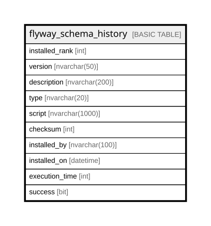

# flyway_schema_history

## Description

## Columns

| Name | Type | Default | Nullable | Children | Parents | Comment |
| ---- | ---- | ------- | -------- | -------- | ------- | ------- |
| installed_rank | int |  | false |  |  |  |
| version | nvarchar(50) |  | true |  |  |  |
| description | nvarchar(200) |  | true |  |  |  |
| type | nvarchar(20) |  | false |  |  |  |
| script | nvarchar(1000) |  | false |  |  |  |
| checksum | int |  | true |  |  |  |
| installed_by | nvarchar(100) |  | false |  |  |  |
| installed_on | datetime | (getdate()) | false |  |  |  |
| execution_time | int |  | false |  |  |  |
| success | bit |  | false |  |  |  |

## Constraints

| Name | Type | Definition |
| ---- | ---- | ---------- |
| flyway_schema_history_pk | PRIMARY KEY | CLUSTERED, unique, part of a PRIMARY KEY constraint, [ installed_rank ] |

## Indexes

| Name | Definition |
| ---- | ---------- |
| flyway_schema_history_pk | CLUSTERED, unique, part of a PRIMARY KEY constraint, [ installed_rank ] |
| flyway_schema_history_s_idx | NONCLUSTERED, [ success ] |

## Relations

---

> Generated by [tbls](https://github.com/k1LoW/tbls)
