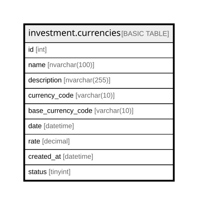

# investment.currencies

## Description

Stores historical foreign exchange rates between a currency and a base currency for a given date.

## Columns

| Name | Type | Default | Nullable | Children | Parents | Comment |
| ---- | ---- | ------- | -------- | -------- | ------- | ------- |
| id | int |  | false |  |  | Unique identifier for each FX rate record. |
| name | nvarchar(100) |  | false |  |  | Name of the currency code. |
| description | nvarchar(255) |  | true |  |  | Description of the currency code. |
| currency_code | varchar(10) |  | false |  |  | Currency code being converted. |
| base_currency_code | varchar(10) |  | false |  |  | Base currency code used for conversion. |
| date | datetime |  | false |  |  | Date of the exchange rate. |
| rate | decimal |  | false |  |  | Exchange rate of currency_code to base_currency_code on the given date. |
| created_at | datetime | (getdate()) | false |  |  | Timestamp when the FX rate record was created in the system. |
| status | tinyint | ((1)) | false |  |  | Indicates if the FX rate record is active (1) or inactive (0). |

## Constraints

| Name | Type | Definition |
| ---- | ---- | ---------- |
| PK__currenci_* | PRIMARY KEY | CLUSTERED, unique, part of a PRIMARY KEY constraint, [ id ] |

## Indexes

| Name | Definition |
| ---- | ---------- |
| PK__currenci_* | CLUSTERED, unique, part of a PRIMARY KEY constraint, [ id ] |

## Relations

---

> Generated by [tbls](https://github.com/k1LoW/tbls)
