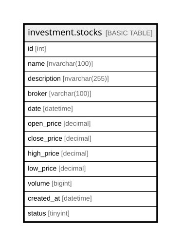

# investment.stocks

## Description

Stores historical or real-time stock market price data,  
        including open, close, high, low, and volume for a given date.

## Columns

| Name | Type | Default | Nullable | Children | Parents | Comment |
| ---- | ---- | ------- | -------- | -------- | ------- | ------- |
| id | int |  | false |  |  | Unique identifier for each stock price record. |
| name | nvarchar(100) |  | false |  |  | Name of the stock. |
| description | nvarchar(255) |  | true |  |  | Description of the stock. |
| broker | varchar(100) |  | true |  |  | Financial platform or broker managing the investment (e.g., XP, Nubank, Binance). |
| date | datetime |  | false |  |  | Date or timestamp of the market data (daily or intraday). |
| open_price | decimal |  | false |  |  | Stock price at the beginning of the trading session. |
| close_price | decimal |  | false |  |  | Stock price at the end of the trading session. |
| high_price | decimal |  | false |  |  | Highest traded price during the session. |
| low_price | decimal |  | false |  |  | Lowest traded price during the session. |
| volume | bigint |  | false |  |  | Total number of shares traded during the session. |
| created_at | datetime | (getdate()) | false |  |  | Timestamp when the record was created in the system. |
| status | tinyint | ((1)) | false |  |  | Status flag indicating if the record is active (1) or inactive (0). |

## Constraints

| Name | Type | Definition |
| ---- | ---- | ---------- |
| PK__stocks_* | PRIMARY KEY | CLUSTERED, unique, part of a PRIMARY KEY constraint, [ id ] |

## Indexes

| Name | Definition |
| ---- | ---------- |
| PK__stocks_* | CLUSTERED, unique, part of a PRIMARY KEY constraint, [ id ] |

## Relations

---

> Generated by [tbls](https://github.com/k1LoW/tbls)
