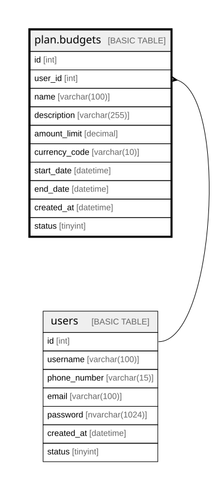

# plan.budgets

## Description

Defines user-created financial budgets within the planning module.

## Columns

| Name | Type | Default | Nullable | Children | Parents | Comment |
| ---- | ---- | ------- | -------- | -------- | ------- | ------- |
| id | int |  | false |  |  | Unique identifier for each budget (primary key). |
| user_id | int |  | false |  | [users](users.md) | Identifier of the user who owns or created the budget (foreign key to dbo.users). |
| name | varchar(100) |  | false |  |  | Name assigned to the budget (e.g., "Vacation 2025" or "Monthly Groceries"). |
| description | varchar(255) |  | true |  |  | Optional detailed description of the budget purpose or scope. |
| amount_limit | decimal |  | false |  |  | Total monetary limit allocated for this budget period. |
| currency_code | varchar(10) |  | false |  |  | Currency associated with the budget (e.g., USD, BRL, EUR). |
| start_date | datetime |  | false |  |  | Date when the budget becomes active. |
| end_date | datetime |  | false |  |  | Date when the budget period ends. |
| created_at | datetime | (getdate()) | false |  |  | Timestamp when the budget record was created. |
| status | tinyint | ((1)) | false |  |  | Indicates whether the budget is active (1), inactive (0), or archived. |

## Constraints

| Name | Type | Definition |
| ---- | ---- | ---------- |
| PK__budgets_* | PRIMARY KEY | CLUSTERED, unique, part of a PRIMARY KEY constraint, [ id ] |
| FK__budgets__user_id_* | FOREIGN KEY | FOREIGN KEY(user_id) REFERENCES users(id) ON UPDATE NO_ACTION ON DELETE NO_ACTION |

## Indexes

| Name | Definition |
| ---- | ---------- |
| PK__budgets_* | CLUSTERED, unique, part of a PRIMARY KEY constraint, [ id ] |

## Relations

---

> Generated by [tbls](https://github.com/k1LoW/tbls)
