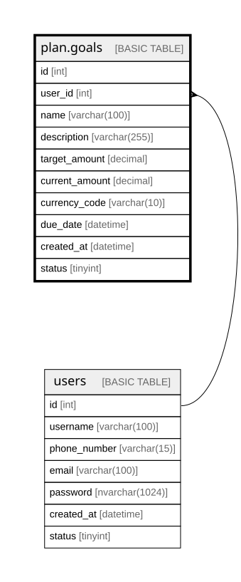

# plan.goals

## Description

Tracks user-defined financial goals and their progress toward a target amount.

## Columns

| Name | Type | Default | Nullable | Children | Parents | Comment |
| ---- | ---- | ------- | -------- | -------- | ------- | ------- |
| id | int |  | false |  |  | Unique identifier for each goal (primary key). |
| user_id | int |  | false |  | [users](users.md) | Identifier of the user who owns the goal (foreign key to dbo.users). |
| name | varchar(100) |  | false |  |  | Descriptive name of the financial goal (e.g., "Emergency Fund" or "New Car"). |
| description | varchar(255) |  | true |  |  | Optional details about the purpose or motivation behind the goal. |
| target_amount | decimal |  | false |  |  | Total amount the user aims to reach for this goal. |
| current_amount | decimal |  | false |  |  | Amount currently saved or achieved toward the target. |
| currency_code | varchar(10) |  | false |  |  | Currency associated with the goal (e.g., USD, BRL, EUR). |
| due_date | datetime |  | false |  |  | Target date by which the goal should be achieved. |
| created_at | datetime | (getdate()) | false |  |  | Date and time when the goal record was created. |
| status | tinyint | ((1)) | false |  |  | Indicates the goal state (1 = active, 0 = inactive, others for future use). |

## Constraints

| Name | Type | Definition |
| ---- | ---- | ---------- |
| PK__goals_* | PRIMARY KEY | CLUSTERED, unique, part of a PRIMARY KEY constraint, [ id ] |
| FK__goals__user_id_* | FOREIGN KEY | FOREIGN KEY(user_id) REFERENCES users(id) ON UPDATE NO_ACTION ON DELETE NO_ACTION |

## Indexes

| Name | Definition |
| ---- | ---------- |
| PK__goals_* | CLUSTERED, unique, part of a PRIMARY KEY constraint, [ id ] |

## Relations

---

> Generated by [tbls](https://github.com/k1LoW/tbls)
