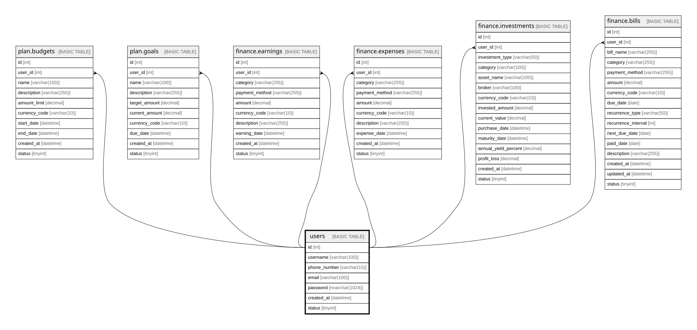

# users

## Description

Stores registered application users and their authentication data.

## Columns

| Name | Type | Default | Nullable | Children | Parents | Comment |
| ---- | ---- | ------- | -------- | -------- | ------- | ------- |
| id | int |  | false | [plan.budgets](plan.budgets.md) [plan.goals](plan.goals.md) [finance.earnings](finance.earnings.md) [finance.expenses](finance.expenses.md) [finance.investments](finance.investments.md) [finance.bills](finance.bills.md) |  | Unique identifier for each user (primary key). |
| username | varchar(100) |  | false |  |  | Public username chosen by the user (unique within the system). |
| phone_number | varchar(15) |  | true |  |  | Optional phone number used for contact or verification. |
| email | varchar(100) |  | false |  |  | Primary email address of the user (used for login and notifications). |
| password | nvarchar(1024) |  | true |  |  | Hashed password for authentication (never stored in plain text). |
| created_at | datetime | (getdate()) | false |  |  | Date and time when the user record was created. |
| status | tinyint | ((1)) | false |  |  | User status flag (1 = active, 0 = inactive, others for future states). |

## Constraints

| Name | Type | Definition |
| ---- | ---- | ---------- |
| PK__users_* | PRIMARY KEY | CLUSTERED, unique, part of a PRIMARY KEY constraint, [ id ] |

## Indexes

| Name | Definition |
| ---- | ---------- |
| PK__users_* | CLUSTERED, unique, part of a PRIMARY KEY constraint, [ id ] |

## Relations

---

> Generated by [tbls](https://github.com/k1LoW/tbls)
